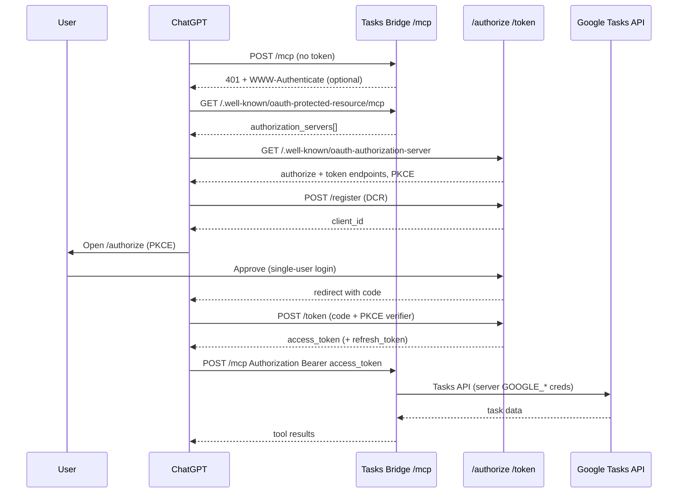

# MCP endpoint OAuth design (ChatGPT + Railway)

This document describes a **minimal OAuth 2.1 flow** so ChatGPT can connect to Tasks Bridge over **public HTTPS** (Railway) without static bearer tokens — which the ChatGPT connector UI does not support today.

**Status:** Design / roadmap (not implemented yet).

## Problem

| Auth method | ChatGPT connector UI | Cursor localhost | curl / scripts |
|---|---|---|---|
| Static `MCP_API_TOKEN` bearer | **No** | N/A (local skips auth) | Yes |
| MCP OAuth (PKCE) | **Yes** | N/A | Via OAuth dance |
| OpenAI tunnel | **Yes** (control plane) | Yes | N/A |

Today:

- **ChatGPT** → OpenAI tunnel → `localhost:8000/mcp` ([chatgpt-tunnel.md](chatgpt-tunnel.md))
- **Railway** → bearer auth on `/mcp` ([http_security.py](../http_security.py)) — useful for scanners and generic clients, **not ChatGPT**

Goal: add MCP-standard OAuth so ChatGPT can use `https://<app>.up.railway.app/mcp` directly.

## MCP + ChatGPT requirements (spec summary)

ChatGPT follows the [MCP authorization spec](https://modelcontextprotocol.io/specification/2025-06-18/basic/authorization) and [OpenAI Apps SDK auth guide](https://developers.openai.com/apps-sdk/build/auth):

1. **Protected Resource Metadata (RFC 9728)** on the MCP server  
   - e.g. `GET https://<host>/.well-known/oauth-protected-resource/mcp`  
   - Returns `resource`, `authorization_servers`, `scopes_supported`

2. **Authorization Server Metadata (RFC 8414)**  
   - e.g. `GET https://<host>/.well-known/oauth-authorization-server`  
   - Returns `authorization_endpoint`, `token_endpoint`, PKCE support, optional `registration_endpoint`

3. **OAuth 2.1 authorization code + PKCE (S256)**  
   - ChatGPT registers dynamically (DCR) or uses CIMD / predefined client  
   - User completes browser consent  
   - ChatGPT sends `Authorization: Bearer <access_token>` on MCP requests

4. **401 + WWW-Authenticate (optional but helpful)**  
   ```http
   HTTP/1.1 401 Unauthorized
   WWW-Authenticate: Bearer resource_metadata="https://<host>/.well-known/oauth-protected-resource/mcp", scope="tasks:read"
   ```

ChatGPT may fetch well-known URLs **directly** (without a prior 401). Paths must not be rewritten by proxies (Railway/nginx).

## Good news: FastMCP already includes OAuth plumbing

Our dependency `mcp>=1.28.1` / FastMCP supports:

- `auth=AuthSettings(issuer_url=..., resource_server_url=...)`
- `auth_server_provider=...` → mounts `/authorize`, `/token`, `/register`, metadata routes
- `token_verifier` → validates bearer tokens on `/mcp`
- Protected resource routes via `create_protected_resource_routes`

We should **prefer FastMCP native auth** over extending `http_security.py` when OAuth mode is enabled.

## Recommended architecture (single-user bridge)

For Tasks Bridge, co-locate the **authorization server** and **resource server** on the same Railway host:

```
https://tasks-bridge.up.railway.app
├── /mcp                          ← MCP (requires OAuth access token)
├── /.well-known/oauth-protected-resource/mcp
├── /.well-known/oauth-authorization-server
├── /authorize                    ← browser consent (single operator)
├── /token                        ← code + refresh exchange
└── /register                     ← DCR for ChatGPT (enable)
```

| Setting | Example value |
|---|---|
| `resource_server_url` | `https://tasks-bridge.up.railway.app/mcp` |
| `issuer_url` | `https://tasks-bridge.up.railway.app` |
| `required_scopes` | `["tasks:read", "tasks:write"]` or `["tasks"]` |
| DCR | `ClientRegistrationOptions(enabled=True)` |

Google Tasks OAuth (`GOOGLE_*`) stays **separate** — it authorizes the server to Google. MCP OAuth authorizes **ChatGPT (or other clients) to your MCP server**.

## Minimal OAuth flow (ChatGPT user)



## Implementation options

### Option A — External IdP (Auth0, Okta, Cognito)

- MCP server: `token_verifier` only (resource server mode)
- IdP hosts authorization server metadata
- **Pros:** Battle-tested login, MFA, audit
- **Cons:** Extra service/cost; overkill for single-user personal bridge

### Option B — Built-in minimal AS (recommended for this project)

- Implement `OAuthAuthorizationServerProvider` with in-memory store (or SQLite)
- Simple `/authorize` HTML page: “Allow ChatGPT to access your Tasks Bridge?” + optional shared PIN
- Enable DCR for ChatGPT
- Wire FastMCP `auth=` + `auth_server_provider=` in `mcp_server.py` when `MCP_AUTH_MODE=oauth`
- **Pros:** No third party; fits single-user model; uses SDK routes
- **Cons:** We own token storage, rotation, and hardening

### Option C — Keep tunnel only (current)

- No Railway OAuth work; Mac must run for ChatGPT
- **Pros:** Already works
- **Cons:** No always-on ChatGPT without local machine

**Recommendation:** **Option B** for Railway + ChatGPT; keep **Option C** for daily dev.

## Auth mode switch (proposed config)

| `MCP_AUTH_MODE` | Use case | Behavior |
|---|---|---|
| `none` | Local dev (default) | No inbound auth on `/mcp` |
| `static` | Railway hardening / scripts | Current `MCP_API_TOKEN` bearer ([http_security.py](../http_security.py)) |
| `oauth` | ChatGPT + Railway HTTPS | FastMCP OAuth; disable static bearer wrapper |

Production Railway with ChatGPT should use `oauth`. Static bearer and OAuth should **not** both wrap `/mcp`.

## Proposed new env vars (Option B)

| Variable | Purpose |
|---|---|
| `MCP_AUTH_MODE` | `none` \| `static` \| `oauth` |
| `MCP_OAUTH_ISSUER_URL` | `https://<app>.up.railway.app` |
| `MCP_OAUTH_RESOURCE_URL` | `https://<app>.up.railway.app/mcp` |
| `MCP_OAUTH_SCOPES` | e.g. `tasks:read,tasks:write` |
| `MCP_OAUTH_CONSENT_SECRET` | Optional PIN shown on authorize page (single-user gate) |
| `MCP_OAUTH_TOKEN_TTL_SECONDS` | Access token lifetime (default 3600) |

Keep existing `GOOGLE_*` for Google Tasks API access.

## ChatGPT connector setup (after implementation)

1. Deploy Tasks Bridge to Railway with `MCP_AUTH_MODE=oauth`
2. In ChatGPT → **Settings → Connectors** → add MCP URL:  
   `https://<app>.up.railway.app/mcp`
3. Choose **OAuth** (not API key)
4. Complete browser consent when prompted
5. Test `get_bridge_diagnostics` / `get_task_lists`

## Implementation phases

### Phase 1 — Design + spike (1–2 days)

- [ ] Confirm ChatGPT fetches `/.well-known/oauth-authorization-server` vs `/mcp`-suffixed variant on Railway
- [ ] Spike FastMCP `auth=` on local HTTPS (mkcert) or ngrok
- [ ] Verify DCR + PKCE handshake with ChatGPT once

### Phase 2 — Minimal provider (3–5 days)

- [ ] `mcp_oauth_provider.py` — in-memory codes/tokens/clients
- [ ] Simple authorize HTML template (approve/deny)
- [ ] Wire `mcp_server.py` auth modes; bypass `http_security` bearer when `oauth`
- [ ] Tests: metadata routes, token exchange, 401 WWW-Authenticate shape

### Phase 3 — Production hardening (2–3 days)

- [ ] Persistent token store or short TTL + refresh only
- [ ] Rate limits on `/authorize` and `/token`
- [ ] Docs + Railway checklist update
- [ ] Remove or demote `MCP_API_TOKEN` when `oauth` is default for production

## Conflicts with current code

| Component | Change needed |
|---|---|
| [http_security.py](../http_security.py) | Skip `/mcp` bearer gate when `MCP_AUTH_MODE=oauth` |
| [mcp_server.py](../mcp_server.py) | Pass `auth=` / `auth_server_provider=` to FastMCP |
| [config.py](../config.py) | Add `MCP_AUTH_MODE` and OAuth URLs |
| [docs/railway.md](railway.md) | Link here; ChatGPT OAuth setup steps |
| [PROJECT_STATUS.md](../PROJECT_STATUS.md) | Track phase completion |

## Security notes (single-user)

- MCP OAuth protects **who can call your MCP server** (ChatGPT, random internet)
- Google OAuth protects **which Google account’s Tasks** the server uses
- Approve page should be boring and explicit: one operator, one bridge
- Prefer **HTTPS only** on Railway (already true)
- Enable DCR but validate redirect URIs per MCP SDK handler
- Do not expose Google refresh tokens to ChatGPT — they never leave the server

## References

- [MCP Authorization spec](https://modelcontextprotocol.io/specification/2025-06-18/basic/authorization)
- [OpenAI Apps SDK — Authenticate users](https://developers.openai.com/apps-sdk/build/auth)
- [RFC 9728 — Protected Resource Metadata](https://www.rfc-editor.org/rfc/rfc9728)
- [RFC 8414 — Authorization Server Metadata](https://www.rfc-editor.org/rfc/rfc8414)
- FastMCP: `mcp.server.auth.routes`, `mcp.server.auth.settings.AuthSettings`
